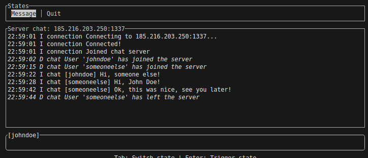

# UIOP DSP TUI Chat Client
  
A TUI client for interacting with a DSP chat server.  
For reference DSP is a [chat protocol](./docs/DSP.pdf) made up in the scope of "Datoriķdienas 2025" (an anniversary event of the Faculty of Computing in University of Latvia).  
_N.B. I took no part in the design of the protocol, I just saw it and implemented a client._  

## Example
  
  
  
## Usage
  
Development:  
```bash
$ cargo run -- --username johndoe
```
  
Production:  
```bash
$ cargo build --release
$ ./target/release/uiop-client --username johndoe
```
